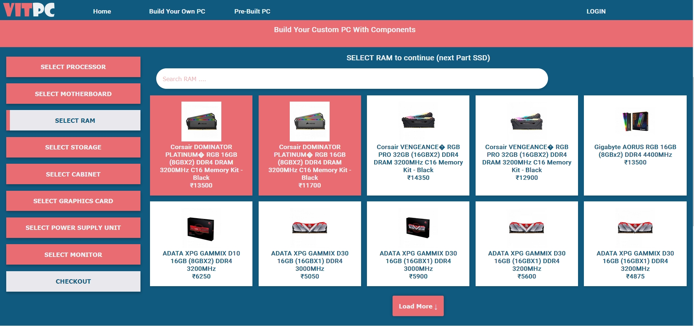

# BuildYourPC
Build your own PC is a webapp aims to reduce the time spent on building a PC, it provides you with a list of components and you can build your own PC



## Frontend Setup 
```

// install yarn
npm install -g yarn

// install packages
yarn install

// runserver
yarn dev
```


## Backend Setup 
```
# make venv
python -m venv venv

# activate venv (powershell)
cd "venv\Scripts"
.\activate


# install dependencies
pip install django-cors-headers django

# run server
python manage.py runserver
```
